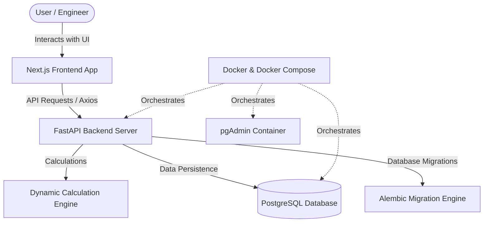

# ⚡ ACSR Transmission Line Voltage Regulation System (ACSR-VRS)

Welcome to the **ACSR Transmission Line Voltage Regulation System**—an industry-grade, professional-scale application designed to compute, analyze, and catalog electrical voltage regulation across multi-segment high-voltage transmission lines. 

This repository houses the **Next.js Frontend Client**, which integrates seamlessly with the **FastAPI Python Backend** to perform highly complex calculations, audit guidelines from the **Central Electricity Authority (CEA)**, and manage project histories in a robust database.

---

## 🏗️ System Architecture Overview

The system is split into two primary components to maintain clean separation of concerns and high scalability:



### 1. Frontend Client (Next.js & React)
* **Framework**: Next.js 14 (App Router) using TypeScript.
* **Styling**: Tailored Dark Theme using Tailwind CSS, Shadcn UI components, and Lucide icons for a premium, engineering-focused look.
* **State Management**: Context-based store (`CalculatorProvider`) for unified input tracking.
* **API Client**: Axios configured with custom interceptors and local environment endpoints.
* **Caching & Queries**: `@tanstack/react-query` to handle cache validation, optimistic updates, and automatic history refreshes.

### 2. Backend Services (FastAPI & PostgreSQL)
* **Framework**: Python FastAPI featuring auto-generated Swagger API documentation.
* **Design Patterns**: Clean architecture including Route Handlers, Schema Validation (Pydantic), Service Logic layer, and Database Models.
* **Database**: PostgreSQL with SQLAlchemy ORM and Alembic migrations.
* **Infrastructure**: Dockerized environment with Docker Compose orchestrating the FastAPI server, PostgreSQL, and pgAdmin.

---

## 📊 Core Calculation Engine & Math Formulas

The core calculation logic is 100% dynamic, avoiding hardcoded values, and is optimized for multi-segment distributed loads.

### 1. The Mathematical Formula
Voltage Regulation percentage ($VR\%$) is calculated as:

$$\text{Voltage Regulation } (VR\%) = \frac{\text{Numerator}}{\text{Denominator}}$$

#### A. Numerator ($\sum L \times P$)
Represents the total load-distance index across all segment lines:
$$\text{Numerator} = \sum_{i=1}^{n} (L_i \times P_i)$$
* $L_i$: Length of segment $i$ in kilometers ($\text{KM}$).
* $P_i$: Power/load on segment $i$ in megavolt-amperes ($\text{MVA}$).

#### B. Denominator
* **Without Reactance**:
  $$\text{Denominator} = I \times R \times \cos\phi \times DF$$
* **With Reactance** (Consider Reactance = `true`):
  $$\text{Denominator} = (I \times R \times \cos\phi + I \times X \times \sin\theta) \times DF$$
  * Where:
    * $I$: Load Current in Amperes ($\text{Amps}$)
    * $R$: Conductor AC Resistance per kilometer ($\Omega/\text{KM}$)
    * $X$: Conductor Inductive Reactance per kilometer ($\Omega/\text{KM}$)
    * $\cos\phi$: Power Factor
    * $\sin\theta = \sqrt{1 - \cos^2\phi}$
    * $DF$: Diversity Factor

---

## 🔌 Central Electricity Authority (CEA) Rules & Advisory

The application incorporates a standard database of **ACSR (Aluminum Conductor Steel Reinforced)** conductors, auditing inputs against standard operating guidelines:

| ACSR Conductor Type | Size ($\text{mm}^2$) | Resistance ($\Omega/\text{KM}$) | Reactance ($\Omega/\text{KM}$) | Weight ($\text{kg/km}$) | Max Recommended Voltage |
|:---|:---:|:---:|:---:|:---:|:---:|
| **Rabbit** | 50 | 0.5426 | 0.370 | 214 | **33 kV** |
| **Dog** | 100 | 0.2733 | 0.315 | 394 | **66 kV** |
| **Panther** | 200 | 0.1363 | 0.305 | 974 | **132 kV** |
| **Zebra** | 420 | 0.0687 | 0.320 | 1621 | **220 kV** |
| **Moose** | 520 | 0.0555 | 0.330 | 2001 | **400 kV** |

### 🚨 Smart Warnings & CEA Alerts
1. **Voltage Mismatch Advisory**: If an ACSR conductor is loaded above its standard voltage rating (e.g., using *Rabbit* at $132\text{ kV}$), the system alerts the user that it will face excessive corona loss, electromagnetic interference, and thermal overloading.
2. **Economic Advisory (Oversized Conductor)**: If an extra-high voltage (EHV) conductor is selected for a low voltage application (e.g., *Moose* at $11\text{ kV}$), the system highlights that this is highly uneconomical due to tower loading weights and high material costs.

---

## 🛠️ Getting Started & Run Locally

### Prerequisites
* **Node.js** (v18+)
* **Docker & Docker Compose** (for backend database & services)

### Step 1: Start Backend (Docker Compose)
In the backend project directory:
```bash
cd ../voltage-regulation-api-backend
docker-compose up -d --build
```
Verify the API is running by visiting:
* Swagger API Docs: [http://localhost:8000/docs](http://localhost:8000/docs)
* API Health Check: [http://localhost:8000/health](http://localhost:8000/health)

### Step 2: Configure Frontend Environments
Create/verify the `.env.local` file in this directory:
```env
NEXT_PUBLIC_URL=http://localhost:8000/api/v1
```

### Step 3: Run Frontend
In this directory, install dependencies and start the development server:
```bash
npm install
npm run dev
```
Open [http://localhost:3000](http://localhost:3000) to view the web application interface.

---

## 📦 Directory Structure (Frontend)

```
voltage-regulation/
├── src/
│   ├── app/                    # Next.js App Router (pages & layout)
│   ├── components/             # Reusable UI Components
│   │   ├── calculator/         # Calculation page sub-components
│   │   └── ui/                 # Basic UI blocks (Card, Input, Button, Badge)
│   ├── context/                # Calculator Context for state sharing
│   ├── hooks/                  # TanStack React Query hooks for API operations
│   ├── lib/                    # Axios clients, UTs, and Conductor databases
│   ├── service/                # API service definitions (Axios calls)
│   └── types/                  # TypeScript interface definitions
├── public/                     # Static assets
├── tsconfig.json               # TypeScript configuration
├── package.json                # Project dependencies
└── README.md                   # This file
```

---

## 🏆 Key Business Value for Your Manager

* **High Calculation Accuracy**: Dynamically factors in reactance, power factor angles ($\sin\theta$), and multi-segment line lengths to ensure calculations match real-world field conditions.
* **Risk Mitigation**: Standard CEA planning advisories protect against structural failure, corona losses, and uneconomic material choices before construction.
* **Historical Auditing**: All calculation runs are automatically stored, paginated, and fully searchable to serve as an engineering registry.
* **Production-Ready Code**: Written using clean code principles, full TypeScript types, React Query caching, and containerized Docker orchestrations, making it ready for production deployment.
